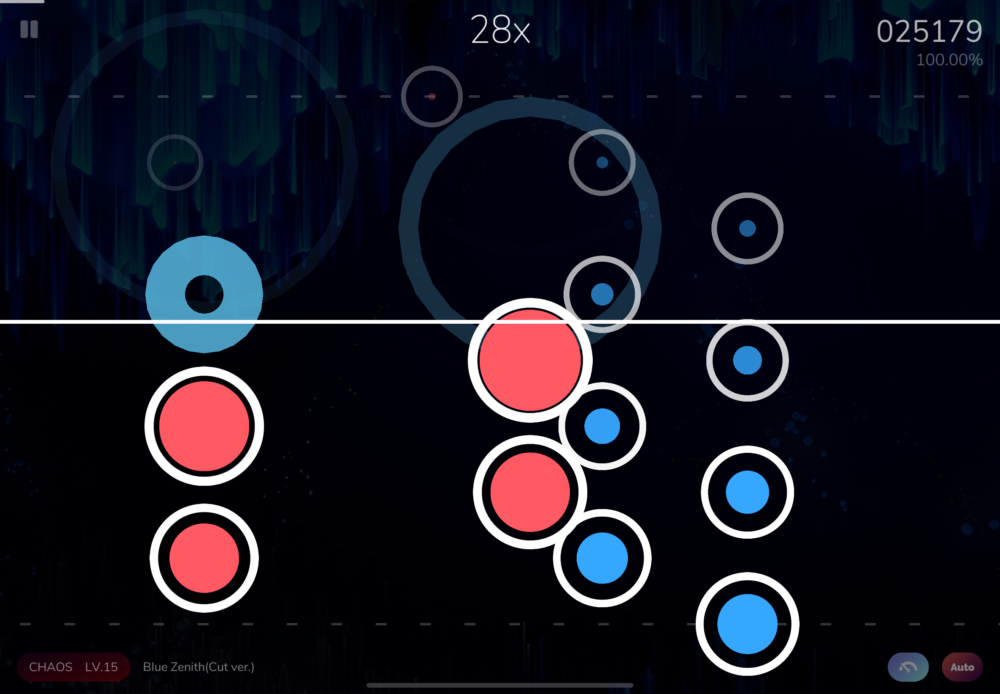
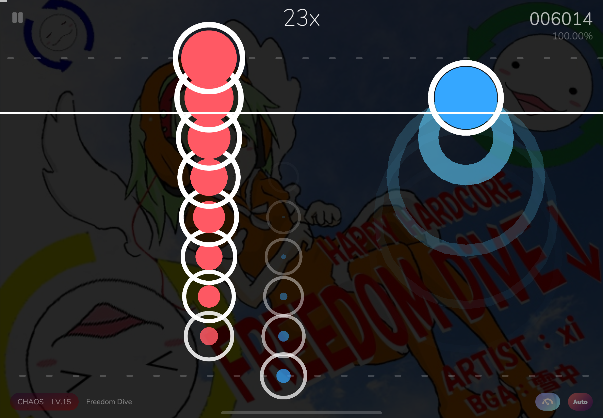
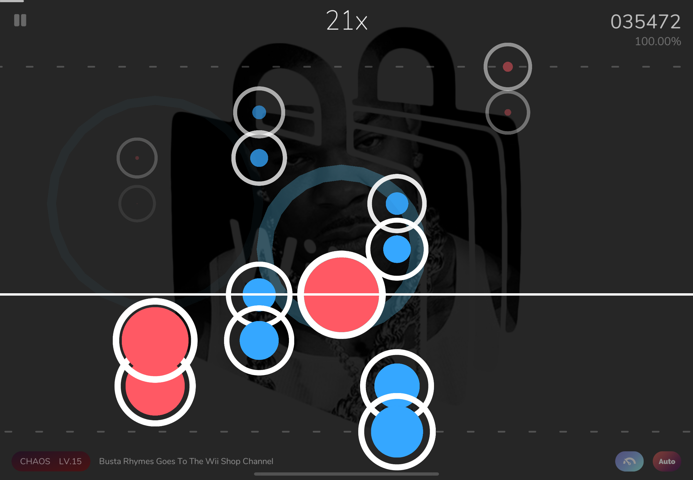
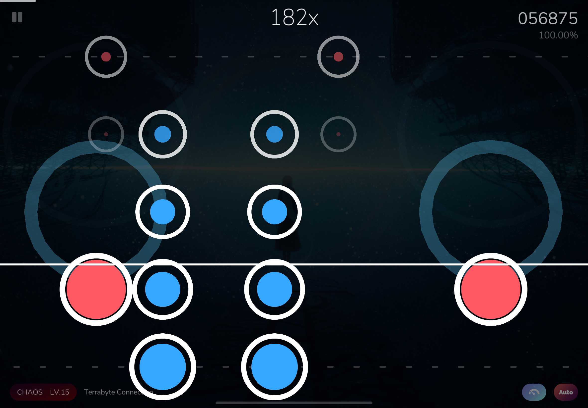

# Cy2Gen
Cy2Gen is a open source project for generating Cytoid levels directly from audio. This project focus on generating specific note patterns that occur commonly in Cytus II and Cytoid, so that players(especially try-hards) will find it convenient and efficient to practice with. This project also provides a starting point for chart creators to rapidly generate playable charts while retaining the freedom for further manual refinement. Currently, it supports 5 note patterns:
tap, drill, stream, bullet, jack(more to be added).

Generation examples:<p>

<br>



## How to Use
1. Set up the environment
- install Python
- install other requirements:
```commandline
pip install -r requirements.txt
```

2. Launch Jupyter Notebook
Open `notebooks/generate_cy2.ipynb` directly by executing `main.py`
```commandline
python main.py
```
Please follow the instructions in the notebook.

## How Cy2Gen works
After user uploads a song(.mp3) and an optional background image, Cy2Gen uses the Madmom library to analyze the audio file and automatically detect the BPM, as well as the first and last downbeat. Then a Cytoid chart will be generated with algorithm of specific note pattern with a consistent page layout and timed note placements.<p>
The project will also calculate a recommended local offset of generated chart, which ensures audio sync. Finally, Cy2Gen packages the audio, background, metadata, and chart into a playable Cytoid level folder compatible with the game.

## Special Thanks
This project is inspired by [**BeatLearning**](https://github.com/sedthh/BeatLearning). Also thank [**Cytoid**](https://cytoid.io/) for providing an open platform for rhythm game and an accessible chart format that empowers developers and players to create and share content freely. 


